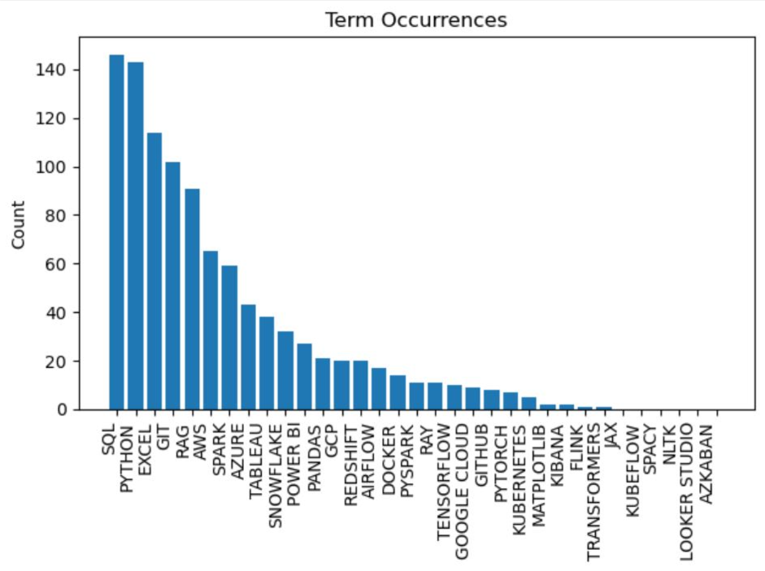

# Linkedin scraping and datascience

### Summary
Linkedin's job offer search engine does not filter correctly and returns many irrelevant offers. The scraper included in this repository allows one to extract only relevant offers. Furthermore, the offers are analyzed to find and quantify some relevant data.

### The scraper
The scraper _linkedin_scraping.py_ can be found in the folder _1_0_Scraping_. It collects offers within a Linkedin/jobs search and filters them by a keyword. The job offers together with their titles, company names and location are stored in an SQLite database and a tab-separated text file. A similarity test is then performed  to avoid saving already stored job offers. 

### Data analysis
The Jupyter Notebook LinkedinOffers.ipynb located in the _2_DataAnalysis_ folder reads the database and generantes a Pandas dataframe. Then it performs the following operations on the data:

- Counts the number of offers per company.
- Creates a job-offer similarity matrix for a given company.
- Finds, counts and plots in a histogram some common terms corresponding to data science tools.
- Finds job offers with no common terms (job offers that are possibly unrelated to data science).
- Finds and plots the percentage of job offers that imply hybrid, remote or on-site work.
- Reads the job offers to find the years of experience required where specified.
- Reads the job offers to find the salary where specified.
- Stores the extracted data in a new database table
